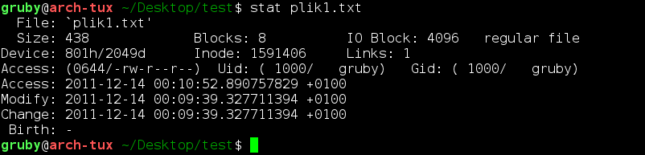

> **<u>Wprowadzenie do systemu Unix</u>** **<u>Wszystkie komendy z
> ćwiczeń z opisem działania</u>**
>
> <u>Spis treści:</u>
>
> ➢**Wymagania** **do** **1.** **Kolokwium,** **opis** **podstawowych**
> **komend** **–** **2** ➢**Pliki** **/etc/passwd,** **/etc/group,**
> **/etc/shadow,** **/etc/gshadow** **-** **4** ➢**Historia**
> **poleceń,** **wprowadzenie** **–** **6**
>
> ➢**Wypisywanie**
> **jednej** **linii** **z** **pliku:** **komendy** **head** **i**
> **tail** **–** **7** ➢**Manual** **–** **8**
>
>  style="width:0.17014in;height:0.11024in" />➢**Dwa**
> **najpopularniejsze** **interpretery** **w** **/etc/passwd:**
> **komendy** **cat** **oraz** **cut** **–** **10**
>
>  style="width:0.1658in;height:0.10937in" />➢**Polecenie** **awk** **–**
> **11** ➢**Wyszukiwanie** **plików** **katalogu** **po** **znakach**
> **–** **13**
>
>  style="width:0.16493in;height:0.10851in" /> style="width:0.1684in;height:0.10937in" />➢**Tworzenie** **i**
> **usuwanie** **katalogów** **–** **15** ➢**Operacje** **na**
> **plikach** **–** **16**
>
>  style="width:0.1658in;height:0.10937in" /> style="width:0.16927in;height:0.11024in" /> style="width:0.16406in;height:0.10851in" />➢**Prawa** **dostępu**
> **do** **plików** **–** **18** ➢**Prawa** **dostępu** **do**
> **katalogów** **–** **20** ➢**Umaska** **–** **22**
>
>  style="width:0.16493in;height:0.10937in" /> style="width:0.17014in;height:0.10851in" />➢**Prawa** **dostępu**
> **do** **katalogu** **domowego** **–** **23** ➢**Systemy** **plików**
> **–** **24**
>
>  style="width:0.16406in;height:0.10937in" /> style="width:0.16753in;height:0.11024in" />➢**Polecenia** **z**
> **galaxy** **oraz** **shell-lab** **-** **25** ➢**Wyszukiwanie**
> **plików:** **komenda** **find** **–** **26** ➢**Procesy** **-**
> **27**

**<u>Przygotowanie do 1. Kolokwium:</u>**

**<u>Wymagania:</u>**

**Obowiązujące** **komendy**

• man

• cat, more, less

• head, tail

• who, last, w, id

• cal

• pwd

• echo

• ls

• wc

• awk

• uniq, tr, cut, sort

• grep

• find

• ps, jobs

• kill

• df, du

• lsblk

• stat

**Obowiązujące** **pliki** **i** **katalogi**

• /etc/passwd, /etc/group, /etc/shadow, /etc/gshadow

• /etc/fstab

• /, /var, /usr

**Obowiązująca** **składnia**

• \| (pipe)

• przekierowania: , \>\>, 2\>, 2\>\>

• wyrażenia regularne (zgodne z grep)

• glob (globbing) • sygnały (kill -l)

• Ctrl-c, Ctrl-z

• command substitution (\${ ... })

Przykładowe zadanie • Podaj PID procesu, który zużywa najwięcej pamięci
rezydualnej spośród procesów, których rodzicem jest proces o PID równym
1?

**……………………………………………………………………………………………**

w- Udziela informacji o użytkownikach aktualnie zalogowanych i
wykonywanych przez nich programach.

who- Udziela informacji o zalogowanych użytkownikach

last- Udostępnia informację o historii logowań użytkowników

echo - Wyświetlanie tekstu ze standardowego wejścia (klawiatura). Za
pomocą polecenia *echo*, możemy wyświetlić w terminalu tekst, który
wpiszemy z klawiatury. Również za pomocą polecenia *echo* możemy
przenieść tekst do pliku.

tr - Przetłumacz, albo usuń znaki. Polecenie tr umożliwia zmianę znaków
na inne, usuwanie nadmiernej ilości znaków (np. spacji, kropek, itp.).

W linuksie masz do dyspozycji komendę kill, której zadaniem jest
wysłanie sygnału do procesu, w celu jego zamknięcia.

df- Wyświetlanie informacji o wolnym miejscu na dysku. Polecenie df daje
możliwość sprawdzenia w jakim stopniu mamy zajęty dysk twardy.

du- Ile miejsca na dysku zajmuje plik (katalog). Aby sprawdzić ile
miejsca na dysku zajmuje plik (katalog), można użyć polecenia du.

lsblk- to polecenie listujące urządzenia blokowe

stat- Informacje o pliku, lub systemie plików

Gdy potrzebujemy dowiedzieć się paru informacji o pliku, a do dyspozycji
mamy jedynie konsolę, możemy użyć polecenia stat, które to wyświetli
przydatne informacje o pliku. Na rys. 1. pokazano jakie informacje
zostają wyświetlane. W skład informacji wchodzą: Nazwa pliku, rozmiar,
uprawnienia,
[<u>UID</u>](http://en.wikipedia.org/wiki/User_identifier_(Unix)) oraz
[<u>GID</u>](http://en.wikipedia.org/wiki/Group_identifier) właściciela
pliku. Informacja o

rozdzaju pliku (tutaj plik zwykły - regular file). Ilość dowiązań
(links: 1). Data ostatniego dostępu oraz modyfikacji pliku.

**<u>Podstawowy plik konfiguracyjny (/etc/passwd)</u>**

>  style="width:0.36085in;height:0.45085in" /> style="width:1.41583in;height:0.44415in" /> style="width:0.36085in;height:0.45085in" /> style="width:3.80417in;height:0.44415in" /> style="width:0.36085in;height:0.45085in" /> style="width:5.96083in;height:0.44415in" />• Plik tekstowy
>
> • Zawartość może odczytać każdy użytkownik
>
> • Informacja zapisana jest w 7 -miu kolumnach oddzielonych znakiem „:”
> • Kolumny:
>
> 1\) Nazwa użytkownika (login name)
>
> 2\) Dawniej zakodowana postać hasła, obecnie niektóre systemy
> przechowują informacje o stanie hasła
>
> 3\) Numer identyfikacyjny użytkownika (UID)
>
> 4\) Numer grupy podstawowej użytkownika (GID) 5) Opis użytkownika
>
> 6\) Bezwzględna ścieżka dostępu do katalogu domowego użytkownika
> (HOME)
>
> 7\) Bezwzględna ścieżka dostępu do podstawowego interpretera
> użytkownika (SHELL)
>
> **<u>/etc/group</u>**
>
>  style="width:0.36085in;height:0.45085in" /> style="width:1.46083in;height:0.44415in" /> style="width:0.36085in;height:0.45085in" /> style="width:2.8575in;height:0.44415in" /> style="width:0.36085in;height:0.45085in" /> style="width:5.09417in;height:0.44415in" />• Plik tekstowy
>
> • Jedna linia opisuje jedną grupę
>
> • Każda linia podzielona jest na 4 pola oddzielone znakiem „:”
> • Kolumny:
>
> 1\) Nazwa grupy (unikalna w systemie) 2) Obecnie informacja o stanie
> hasła 3) Numer grupy w systemie
>
> 4\) Lista członków grupy
>
> **/etc/shadow**
>
>  style="width:0.36085in;height:0.45085in" /> style="width:1.46083in;height:0.44415in" /> style="width:0.36085in;height:0.45085in" /> style="width:4.37417in;height:0.44415in" /> style="width:0.36085in;height:0.45085in" /> style="width:3.45917in;height:0.44415in" /> style="width:0.36085in;height:0.45085in" /> style="width:5.1075in;height:0.44415in" />• Plik tekstowy
>
> • Budowa linijkowa – jedna linijka-jeden użytkownik • Każda linijka ma
> 9 pól oddzielonych „:”
>
> • Prawa dostępu umożliwiają edycję tylko użytkownikowi root • Kolumny:
>
> 1\) Nazwa użytkownika w systemie (login name) 2) Postać zakodowana
> hasła
>
> 3\) Liczba dni, licząc od 1 stycznia 1970r., kiedy hasło było ostatni
> raz zmienione
>
> 4\) Liczba dni przed upływem których zmiana hasła nie jest możliwa 5)
> Liczba dni po upływie których konieczna jest zmiana hasła
>
> 6\) Liczba dni, jaka dzieli hasło od przedawnienia, kiedy użytkownik
> będzie o tym fakcie powiadomiony.
>
> 7\) Liczba dni, po wygaśnięciu hasła, kiedy konto jest blokowane
> (interwencja administratora)
>
> 8\) Liczba dni, licząc od 1 stycznia 1970r., po upływie których konto
> jest blokowane. Wykorzystywane przy zakładaniu kont tymczasowych.
>
> 9\) Kolumna 9 – pole zarezerwowane
>
> **/etc/gshadow**
>
> • Przechowuje hasło grupowe oraz informacje o administratorach grupy
> • Kolumny:
>
> 1\) kolumna 1 – nazwa grupy w systemie 2) kolumna 2 – hasło grupowe
>
> 3\) kolumna 3 – lista administratorów grupy 4) kolumna 4 – lista
> członków grupy
>
> <u>Historia Poleceń</u>
>
> 1\. **<u>Wprowadzenie:</u>** ➢pwd

**pwd** **-** **Wyświetlenie** **ścieżki** **dostępu** **do**
**bieżącego** **katalogu**. **Za** **pomocą** **polecenia** **pwd**
**możemy** **wyświetlić** **informację,** **gdzie** **się**
**znajdujemy.** **To** **znaczy** **ścieżkę** **do** **katalogu,** **w**
**którym** **aktualnie** **się** **znajdujemy.**

> ➢cat /etc/passwd

**cat** - **Wyświetlanie** **zawartości** **pliku** **na**
**standardowe** **wyjście.** **Do** **obejrzenia** **zawartości**
**pliku** **(zawartość** **wyświetlana** **w** **terminalu),** **bez**
**konieczności** **otwierania** **pliku** **w** **edytorze**
**tekstowym** **służy** **polecenie** **cat,** **wraz** **z**
**różnymi** **parametrami** **ułatwia** **nawigację** **po**
**wyświetlanych** **danych.**

> ➢file /etc/passwd ➢file /bin/ls
>
> ➢file /usr/include/stdio.h

**file** **-** **do** **rozpoznawania** **zawartości** **pliku.**

> ➢more /etc/passwd

**Polecenia** **more,** **less** **będą** **pomocne,** **kiedy**
**zechcemy** **przeczytać** **plik** **lub** **kiedy** **rezultat**
**wykonania** **jakiegoś** **polecenia** **nie** **zmieści** **się**
**na** **ekranie.** **Polecenie** **more** **pozwala** **nam**
**poruszać** **się** **tylko** **w** **dół** **pliku.**

> ➢less /etc/passwd
>
> ➢less /usr/include/stdio.h

**Polecenie** **less** **jest** **podobne** **do** **more,** **ale**
**umożliwia** **poruszanie** **się** **w** **przód** **i** **w** **tył**
**pliku** **lub** **wyniku** **polecenia.**

> ➢wc /etc/passwd ➢wc -l /etc/passwd ➢wc -w /etc/passwd ➢wc -c
> /etc/passwd ➢wc -wc /etc/passwd ➢wc -cw /etc/passwd

**Drukowanie** **informacji** **o** **zawartości** **pliku.** **Za**
**pomocą** **polecenia** **wc** **można** **dowiedzieć** **się**
**(nie** **otwierając** **pliku** **w** **żadnym** **edytorze**
**tekstowym)** **informacji** **na** **temat** **ilości** **bajtów,**
**słów,** **znaków,** **linii,** **oraz** **rozmiarze** **najdłuższej**
**linii.**

**wc** **/etc/passwd:**

**<u>Zlicza liczbę linii, słów i bajtów w pliku /etc/passwd i wyświetla
te informacje.</u>**

**wc** **-l** **/etc/passwd:**

**<u>Zlicza tylko liczby linii w pliku /etc/passwd i wyświetla tę
informację.</u>**

**wc** **-w** **/etc/passwd:**

**<u>Zlicza tylko liczby słów w pliku /etc/passwd i wyświetla tę
informację.</u>**

**wc** **-c** **/etc/passwd:**

**<u>Zlicza tylko liczbę bajtów w pliku /etc/passwd i wyświetla tę
informację.</u>**

**wc** **-wc** **/etc/passwd:**

**<u>Nie jest poprawnym użyciem opcji. wc oczekuje jednej opcji, a tutaj
użyto dwóch</u>** **<u>(-wc). W rezultacie może wystąpić błąd lub
wyświetlone zostaną informacje o</u>** **<u>błędzie.</u>**

**wc** **-cw** **/etc/passwd:**

**<u>Opcje -cw są równoważne i można je podać w dowolnej kolejności.
Zlicza liczbę</u>** **<u>słów i bajtów w pliku /etc/passwd i wyświetla
te informacje.</u>**

> ➢cal ➢cal 23
>
> ➢cal 9 1752

**Narzędzie** cal **wyświetla** **prosty** **kalendarz** **w**
**tradycyjnym** **formacie**

> ➢bc ➢bc -l

**Polecenie** **bc** **jest** **używane** **do** **kalkulatora**
**wiersza** **poleceń.** **Jest** **podobny** **do** **podstawowego**
**kalkulatora,** **za** **pomocą** **którego** **możemy** **wykonać**
**podstawowe** **obliczenia** **matematyczne.**

> ➢head /etc/passwd ➢head -3 /etc/passwd

**Wyświetlanie** **początkowej** **części** **pliku.** **Jeśli**
**potrzebujemy** **wyświetlić** **tylko** **początek** **pliku**
**(np.** **plik** **.c,** **aby** **dowiedzieć** **się** **jakie**
**dołączone** **są** **biblioteki),** **to** **nie** **musimy**
**odrazu** **wyświetlać** **całego** **pliku,** **tylko** **możemy**
**posłużyć** **się** **poleceniem** **head.**

> ➢tail /etc/passwd ➢tail -1 /etc/passwd

**tail** **-** **wyświetlenie** **ostatnich** **części** **plików.**
**Polecenie** **tail** **służy** **do** **wyświetlania** **ostatnich**
**wierszy** **(lub,** **bajtów)** **danego** **pliku.**

> **<u>Wypisywanie jednej linii z pliku</u>**
>
> ➢**head** **-17** **/etc/passwd** ➢**head** **-17** **/etc/passwd**
> **\|** **tail** **-1** ➢**cat** **/etc/passwd** **\|** **head**
> **-17**
>
> ➢**cat** **/etc/passwd** **\|** **tail** **-n+17** **\|** **head**
> **-1**
>
> **head** **-17** **/etc/passwd**
>
> **<u>Wyświetla pierwsze 17 linii pliku /etc/passwd.</u>**
>
> **head** **-17** **/etc/passwd** **\|** **tail** **-1**
>
> **<u>Wyświetla 17. linię pliku /etc/passwd za pomocą połączenia
> komend</u>** **<u>head i tail. head -17 wybiera pierwsze 17 linii, a
> tail -1 wybiera ostatnią</u>** **<u>z tych linii.</u>**
>
> **cat** **/etc/passwd** **\|** **head** **-17**
>
> **<u>Wyświetla pierwsze 17 linii pliku /etc/passwd. W tym
> przypadku</u>** **<u>korzysta z komendy cat do wyświetlenia całego
> pliku, a następnie head</u>** **<u>ogranicza wyniki do pierwszych 17
> linii.</u>**
>
> **cat** **/etc/passwd** **\|** **tail** **-n+17** **\|** **head**
> **-1**
>
> **<u>Wyświetla 17. linię pliku /etc/passwd bez używania head -17. tail
> -n+17</u>** **<u>wybiera linie od 17. w górę, a head -1 wybiera
> pierwszą z tych linii.</u>**
>
> **<u>Manual</u>**
>
> ➢**man** **grep** ➢**man** **passwd** ➢**man** **5** **passwd**

**man** **-** **Podręcznik** **systemowy.** **Bardzo** **często**
**zdarza** **się** **tak** **(ośmiele** **się** **powiedzieć,** **że**
**codziennie),** **że** **nie** **znamy** **dokładnej** **składni**
**polecenia,** **bądź** **nie** **wiemy,** **jakie** **argumenty**
**można** **przekazać** **do** **polecenia,** **w** **tej** **sytuacji**
**z** **pomocą** **zdecydowanie** **przychodzi** **podręcznik**
**systemowy,** **w** **którym** **jest** **pełna** **dokumentacja**
**danego** **programu.**

> **<u>Wyszukiwanie linii w pliku /usr/include/stdio.h</u>**
>
> ➢ **grep** **FILE** **/usr/include/stdio.h** ➢ **grep** **-i**
> **FILE** **/usr/include/stdio.h**
>
> ➢ **grep** **-i** **FILE** **/usr/include/stdio.h** **\|** **wc**
> **-l** ➢ **grep** **-ic** **FILE** **/usr/include/stdio.h**
>
> ➢ **grep** **-ivc** **FILE** **/usr/include/stdio.h** ➢ **wc** **-l**
> **/usr/include/stdio.h**
>
> ➢ **grep** **-iw** **/usr/include/stdio.h**
>
> **grep** **FILE** **/usr/include/stdio.h**
>
> **<u>Wyszukuje linie w pliku /usr/include/stdio.h, które zawierają
> ciąg znaków</u>** **<u>"FILE".</u>**
>
> **grep** **-i** **FILE** **/usr/include/stdio.h**
>
> **<u>Wyszukuje linie w pliku /usr/include/stdio.h, ignorując wielkość
> liter, dla</u>** **<u>ciągu znaków "FILE".</u>**
>
> **grep** **-i** **FILE** **/usr/include/stdio.h** **\|** **wc** **-l**
>
> **<u>Wyszukuje linie w pliku /usr/include/stdio.h dla ciągu znaków
> "FILE",</u>** **<u>ignorując wielkość liter, a następnie używa wc -l
> do zliczenia liczby</u>** **<u>znalezionych linii.</u>**
>
> **grep** **-ic** **FILE** **/usr/include/stdio.h**
>
> **<u>To samo co poprzednia komenda, ale zamiast wc -l, używa opcji -c
> aby zliczyć</u>** **<u>liczbę wystąpień "FILE".</u>**
>
> **grep** **-ivc** **FILE** **/usr/include/stdio.**
>
> **<u>Wyszukuje linie, które nie zawierają ciągu znaków "FILE",
> ignorując</u>** **<u>wielkość liter, a następnie zlicza ilość tych
> linii.</u>**
>
> **wc** **-l** **/usr/include/stdio.h**
>
> **<u>Zlicza liczby linii w pliku /usr/include/stdio.h.</u>**
>
> **grep** **-iw** **/usr/include/stdio.h**
>
> **<u>Wyszukuje linie w pliku /usr/include/stdio.h dla dokładnie
> pasującego ciągu</u>** **<u>znaków "FILE" (ignorując wielkość
> liter).</u>**

**Narzędzie** **służące** **do** **wyszukiwania.**

**Najczęściej** **używane** **opcje:**

> • **-i** ignoruje wielkość liter
>
> • **-r** wyszukuje również w sub katalogach ścieżki
>
> • **-l** pokazuje nazwy plików, w których znajduje się pasujący
> wzorzec • **-n** pokazuje linię, w której występuje szukany wzorzec
>
> • **-v** pokazuje linie, które nie zawierają wzorca
>
> • **-F** traktuje szukany wzorzec, jako escapowany string
>
> • **-E** traktuje szukany wzorzec, jako rozszerzone wyrażenie
> regularne • **-e** informuje, że następny argument, jest wzorcem
>
> • **-c** zwróci nam liczbę pasujących fraz
>
> • **-x** zwróci wynik, tylko i wyłącznie, jeżeli pasuje cała linia
>
> • **-m\[cyfra\]** przerwie wyszukiwanie, po znalezieniu pierwszych
> \[cyfra\] rezultatów

**Opis** **uzytkownika** **o** **UID** **14** ➢cat /etc/passwd \| grep
14 ➢cat /etc/passwd \| grep 1

> ➢cat /etc/passwd \| cut -c1,4,7-9 ➢cat /etc/passwd \| cut -d: -f3,5
>
> ➢cat /etc/passwd \| cut -d: -f3,5 \| grep 14 ➢cat /etc/passwd \| cut
> -d: -f3,5 \| grep '^14:'
>
> ➢cat /etc/passwd \| cut -d: -f3,5 \| grep '^14:' \| cut -d: -f2

**cat** **/etc/passwd** **\|** **grep** **14:**

**<u>Wyświetla linie z pliku /etc/passwd, w których występuje liczba
14.</u>**

**cat** **/etc/passwd** **\|** **grep** **1:**

**<u>Wyświetla linie z pliku /etc/passwd, w których występuje cyfra
1.</u>**

**cat** **/etc/passwd** **\|** **cut** **-c1,4,7-9:**

**<u>Wyświetla określone kolumny (znaki) z pliku /etc/passwd. Kolumny
to: 1, 4,</u>** **<u>oraz 7-9.</u>**

**cat** **/etc/passwd** **\|** **cut** **-d:** **-f3,5:**

**<u>Używa cut do wycięcia pól z pliku /etc/passwd, oddzielonych
dwukropkiem (:).</u>** **<u>Wybiera trzecie i piąte pole, które to
zazwyczaj zawierają UID i pełne imię i</u>** **<u>nazwisko
użytkownika.</u>**

**cat** **/etc/passwd** **\|** **cut** **-d:** **-f3,5** **\|** **grep**
**14:**

**<u>Wycina trzecie i piąte pole z pliku /etc/passwd (UID i pełne imię i
nazwisko</u>** **<u>użytkownika) i następnie filtruje tylko te linie, w
których występuje liczba 14.</u>**

**cat** **/etc/passwd** **\|** **cut** **-d:** **-f3,5** **\|** **grep**
**'^14:':**

**<u>Podobnie jak poprzednia komenda, ale dodatkowo używa grep z ^14:
aby</u>** **<u>dopasować linie, które zaczynają się od 14:. To zazwyczaj
odpowiada</u>** **<u>określonemu UID.</u>**

**cat** **/etc/passwd** **\|** **cut** **-d:** **-f3,5** **\|** **grep**
**'^14:'** **\|** **cut** **-d:** **-f2:**

**<u>Kombinuje wcześniejsze komendy. Wycina drugie pole (imię i
nazwisko</u>** **<u>użytkownika) z linii, które pasują do UID
rozpoczynającego się od 14:.</u>**

**<u>Dwa najpopularniejsze interpretery w /etc/passwd</u>**

> ➢man 5 passwd
>
> ➢cat /etc/passwd \| cut -d: -f7 ➢cat /etc/passwd \| cut -d: -f7 \|
> sort
>
> ➢cat /etc/passwd \| cut -d: -f7 \| sort \| uniq -c
>
> ➢cat /etc/passwd \| cut -d: -f7 \| sort \| uniq -c \| sort -r ➢cat
> /etc/passwd \| cut -d: -f7 \| sort \| uniq -c \| sort -rn
>
> ➢cat /etc/passwd \| cut -d: -f7 \| sort \| uniq -c \| sort -rn \| head
> -2

Komenda **cut** umożliwia wycięcie bajtów, znaków lub pól z każdego
wiersza pliku i zapisanie tych bajtów, znaków lub pól na wyjściu
standardowym. Jeśli parametr *Plik* nie zostanie określony, komenda
**cut** odczytuje standardowe wejście.

man 5 passwd:

<u>Wyświetla podręcznik (manpage) dla pliku /etc/passwd z sekcji 5.
Sekcja 5 w manualu Linuxa</u> <u>dotyczy plików konfiguracyjnych i
formatów plików.</u>

cat /etc/passwd \| cut -d: -f7:

<u>Wyświetla siódme pole z pliku /etc/passwd dla każdej linii, które
jest zazwyczaj informacją o</u> <u>powłoce (shell) użytkownika.</u>

cat /etc/passwd \| cut -d: -f7 \| sort:

<u>Wyświetla siódme pole z pliku /etc/passwd dla każdej linii, sortuje
je alfabetycznie.</u>

> cat /etc/passwd \| cut -d: -f7 \| sort \| uniq -c:
>
> <u>Wyświetla siódme pole z pliku /etc/passwd dla każdej linii, sortuje
> je, a następnie używa uniq</u> <u>-c do zliczenia liczby unikalnych
> wartości i wyświetlenia ich.</u>
>
> cat /etc/passwd \| cut -d: -f7 \| sort \| uniq -c \| sort -r:
>
> <u>Wyświetla siódme pole z pliku /etc/passwd dla każdej linii, sortuje
> je, a następnie używa uniq</u> <u>-c do zliczenia liczby unikalnych
> wartości. Następnie sortuje te wartości w odwrotnej</u> <u>kolejności
> według liczby wystąpień.</u>
>
> cat /etc/passwd \| cut -d: -f7 \| sort \| uniq -c \| sort -rn:
>
> <u>To samo co poprzednia komenda, ale używa skróconego zapisu -rn
> zamiast -r -n do</u> <u>sortowania w odwrotnej kolejności według
> liczby wystąpień.</u>
>
> cat /etc/passwd \| cut -d: -f7 \| sort \| uniq -c \| sort -rn \| head
> -2:
>
> <u>Wyświetla siódme pole z pliku /etc/passwd dla każdej linii, sortuje
> je, a następnie używa uniq</u> <u>-c do zliczenia liczby unikalnych
> wartości. Następnie sortuje te wartości w odwrotnej</u> <u>kolejności
> według liczby wystąpień, a na końcu używa head -2, aby ograniczyć
> wyniki do</u> <u>dwóch pierwszych linii (najczęściej występujących
> powłok).</u>

||
||
||
||
||
||
||

> **<u>Polecenie awk</u> - <u>Służy do wyszukiwania wierszy w plikach,
> które są zgodne ze wzorcem i</u>** **<u>wykonuje określone działania
> na tych wierszach</u>**
>
> ➢ cat /etc/passwd \| awk -F: '{ print \$5 }'
>
> ➢ cat /etc/passwd \| awk -F: '{ if ( \$3 == 14 ) print \$5 }' ➢ cat
> /etc/passwd \| awk -F: '{ if ( \$5 == "" ) print \$1 }'
>
> ➢ cat /etc/passwd \| awk -F: '{ if ( \$5 == "" ) print \$1 \$3 }' ➢
> cat /etc/passwd \| awk -F: '{ if ( \$5 == "" ) print \$1" "\$3 }'
>
> ➢ cat /etc/passwd \| awk -F: '{ if ( \$5 == "" ) print \$1" -\> "\$3
> }' ➢ cat /etc/passwd \| awk -F: '{ if ( \$5 == "" ) print \$3" "\$1 }'

||
||
||
||
||
||
||
||
||
||
||
||
||

||
||
||
||
||
||
||
||
||
||
||
||
||
||
||
||
||
||
||

**<u>Aw</u>k <u>- Służy do wyszukiwania wierszy w plikach, które są
zgodne ze wzorcem i wykonuje określone</u>** **<u>działania na tych
wierszach.</u>**

Dowolny ciąg znaków i jeden znak w nazwach plikow i wyrazeniu regularnym
(wyszukiwanie plików w katalogu po znakach)

> ➢ls /usr/include/st\*.h ➢ls /usr/include/s????? ➢ls
> /usr/include/s?????? ➢ls /usr
>
> ➢ls -d /usr
>
> ➢ls /usr/include/s?????? ➢ls -d /usr/include/s?????? ➢ls /usr/include/
>
> ➢ls /usr/include/ \| less
>
> ➢ls /usr/include/ \| grep st\*.h ➢ls /usr/include/ \| grep '^st\*.h'
> ➢ls /usr/include/ \| grep '^st.\*.h' ➢ls /usr/include/ \| grep
> '^st.\*\\h'
>
> ➢ls /usr/include/ \| grep '^st.\*\\h\$' ➢ls /usr/include/ \| grep
> '^s......' ➢ls /usr/include/ \| grep '^s......\$' ➢ls /usr/include/ \|
> grep '^s.\\6\\\$' ➢ls /usr/include/ \| grep '^s.\\4,6\\\$' ➢ls
> /usr/include/ \| grep '^s.\\4,\\\$' ➢ls /usr/include/ \| grep
> '^s.\\,6\\\$'

**ls-** **Wyświetlenie** **zawartości** **katalogu.** **W** **konsoli,**
**aby** **wyświetlić** **zawartość** **katalogu** **trzeba** **użyć**
**jednego** **z** **kilku** **dostępnych** **poleceń,** **nie**
**mniej** **jednak** **polecenie** ***ls*** **jest** **chyba**
**najbardziej** **popularnym.**

||
||
||
||
||
||
||
||
||
||
||
||
||
||
||
||
||
||
||
||
||
||
||
||
||
||
||
||
||
||
||
||
||
||
||
||
||
||
||
||
||
||
||
||
||
||

||
||
||
||
||
||
||
||
||
||
||
||
||
||
||
||
||
||
||
||
||
||
||
||
||
||
||
||
||
||
||
||
||
||
||
||
||
||
||
||
||
||
||
||
||
||
||
||

||
||
||
||
||
||
||
||
||
||

**Tworzenie** **i** **usuwanie** **katalogów:**

> ➢**cd**
>
> ➢**mkdir** **c3/txt** **c3/bin** ➢**mkdir** **c3** **c3/txt**
> **c3/bin** ➢**ls** **-aliR** **c3**
>
> ➢**rmdir** **c3** ➢**rm** **-rf** **c3** ➢**ls** **-aliR** **c3**
>
> ➢**mkdir** **-p** **c3/txt** **c3/bin** ➢**ls** **-aliR** **c3**
>
> ➢**cd** **c3/txt** ➢**pwd**
>
> cd- Zmiana katalogu. W konsoli, aby zmienić katalog, trzeba użyć
> polecenia cd.

||
||
||
||
||
||
||
||
||
||
||
||
||
||
||
||
||
||
||
||

||
||
||
||
||
||
||
||
||
||
||
||
||
||
||
||
||
||
||
||
||
||
||
||
||
||
||
||
||
||
||
||
||
||

||
||
||
||
||

> **<u>Operacje na plikach:</u>**
>
> ➢**man** **ls** **\>** **ls.txt** ➢**ls** **-l**
>
> ➢**file** **ls.txt** ➢**less** **ls.txt** ➢**cp** **ls.txt**
> **ls.bak** ➢**ls** **-l**
>
> ➢**diff** **ls.txt** **ls.bak** ➢**cp** **/bin/tar** ➢**ls** **-l**
>
> ➢**cp** **/bin/find** **/bin/ls** **/etc/passwd** ➢**ls** **-l**
>
> ➢**mv** **ls** **mls**
>
> **cp** **-** **Kopiowanie** **plików** **(katalogów).** **Aby**
> **kopiować** **pliki** **lub** **katalogi** **za** **pomocą**
> **konsoli** **musimy** **użyć** **polecenia** **cp.** **Polecenia**
> **tego** **można** **użyć** **w** **trzech** **wariantach** **diff**
> **-** **oznacza** **różnicę** **.** **To** **polecenie** **służy**
> **do** **wyświetlania** **różnic** **w** **plikach** **poprzez**
> **porównywanie** **plików** **linia** **po** **linii**

**mv** **-** **Przenieś,** **lub** **zmień** **nazwę** **pliku** **/**
**katalogu.** **Aby** **przenieść** **pliki** **lub** **katalogi**
**za** **pomocą** **konsoli** **używa** **się** **polecenia** **mv.**
**Za** **pomocą** **tego** **polecenia** **również** **zmienia** **się**
**nazwy** **plików,** **lub** **katalogów.**

||
||
||
||
||
||
||
||
||
||
||
||
||
||
||
||
||
||
||
||
||
||
||
||
||
||
||
||
||
||
||
||
||
||
||
||
||
||
||
||
||
||
||
||
||
||
||
||
||
||
||
||
||
||

**<u>Prawa dostepu do plików:</u>**

> ➢**ls** **-l** ➢**id** ➢**tail** **ls.txt**
>
> ➢**chmod** **u-r** **ls.txt** ➢**ls** **-l**
>
> ➢**tail** **ls.txt** ➢**date** ➢**date** **\>\>** **ls.txt** ➢**ls**
> **-l**
>
> ➢**chmod** **u+r,u-w** **ls.txt** ➢**ls** **-l**
>
> ➢**tail** **ls.txt** ➢**diff** **ls.txt** **ls.bak** ➢**diff**
> **ls.bak** **ls.txt** ➢**date** **\>\>** **ls.txt** ➢**rm** **ls.txt**
>
> ➢**ls** **-l** ➢**yes** ➢**./ls.bak**
>
> ➢**chmod** **a+x** **ls.bak** ➢**ls** **-l**
>
> ➢**./ls.bak** ➢**head** **ls.bak**

id - Wyświetlanie prawdziwego i efektywnego ID. Polecenia id używa się
do wyświetlenia informacji o użytkowniku i grupie, podanej jako
argument, lub jeśli argument nie występuje to o aktualnie zalogowanym.

ls- Zmiana dostępu do plików (prawa dostępu). W Linuksie każdy plik
(katalog) ma swoje określone prawa dostępu. Definiują one czy plik może
zostać odczytany, czy można do niego pisać, czy można go wykonać. Prawa
dostępu mogą występować w różnych kombinacjach. Aby sprawdzić prawa
dostępu, trzeba użyć polecenia
[<u>ls</u>](https://www.arturpyszczuk.pl/commands-ls.html) z opcją -l.

rm - Usuwanie plików / katalogów. Aby usuwać pliki lub katalogi, lub
jednocześnie to i to za pomocą konsoli, należy użyć polecenia rm. W
zależności od tego, czy są to tylko pliki, puste katalogi, czy katalogi
z zawartością, trzeba użyć odpowiedniej opcji w poleceniu.

||
||
||
||
||
||

||
||
||
||
||
||
||
||
||
||
||
||
||
||
||
||
||
||
||
||
||
||
||
||
||
||
||
||
||
||
||
||
||
||
||
||
||
||
||
||
||
||
||
||
||
||
||
||
||
||
||
||
||
||
||
||
||

||
||
||
||
||
||
||
||
||
||
||
||
||
||
||
||

<u>Prawa dostepu do katalogow:</u>

> ➢ls -al ➢chmod u-r . ➢ls -al ➢touch plik1 ➢rm mls
>
> ➢chmod u-w,u+r . ➢ls -al
>
> ➢rm passwd ➢touch plik2 ➢chmod u+w,u-x . ➢ls
>
> ➢cd .. ➢ls -al ➢cd txt ➢ls txt ➢ls -al txt ➢ls -al
>
> ➢chmod 702 txt ➢ls -al
>
> ➢chmod 5736 txt
>
> ➢Polecenie **touch** pozwala na utworzenie nowego pustego pliku w
> wierszu poleceń systemu Linux.
>
> ➢Na przykład, wpisz **touch**
> **/twojadomena.pl/public_html/strona.html**, aby utworzyć plik HTML o
> nazwie **strona** w katalogu domowym domeny **twojadomena.pl**.

||
||
||
||
||
||
||
||
||
||
||
||
||
||
||
||
||
||
||
||
||
||
||
||
||
||
||
||
||
||
||
||
||
||
||
||
||
||
||
||
||
||
||
||
||
||
||
||
||
||
||

||
||
||
||
||
||
||
||
||
||

<u>Umaska:</u>

> ➢ls -al ➢cd bin ➢touch p1 ➢mkdir k1 ➢ls -l ➢umask
>
> ➢umask 0027 ➢mkdir k2 ➢touch p2 ➢ls -l
>
> ➢cd ➢umask 0002 ➢ls -l

mkdir - Tworzenie katalogu. Aby utworzyć katalog z użyciem konsoli
musimy użyć polecenia mkdir. Polecenie to bez żadnych dodatkowych opcji
tworzy katalog podany jako argument. Jeśli argumentów będzie więcej, to
odpowiednia liczba katalogów zostanie utworzona.

Maska użytkownika (ang. user mask)

**Polecenie** **umask** **jest** **odpowiedzialne** **za**
**ograniczenie** **praw** **dostępu**
**[(<u>chmod</u>)](https://www.arturpyszczuk.pl/commands-chmod.html).**
**W** **jaki** **sposób** **to** **działa?** **A** **więc** **na**
**początku** **zastanówmy** **się** **nad** **jedną** **rzeczą,** **a**
**mianowicie** **podczas** **tworzenia** **pliku** **(katalogu)**
**nadawane** **są** **jakieś** **uprawnienia** **dla** **tego**
**pliku** **(katalogu).** **No** **dobrze,** **to** **jakie** **są**
**te** **uprawnienia?** **Tutaj** **właśnie** **wchodzi** **rola**

**polecenia** **umask.** **Standardowo** **w** **systemie** **Linux**
**uprawnienia** **dla** **tworzonego** **pliku** **są** **rw-rw-rw-**
**(ósemkowo** **666)** **jeśli** **maska** **jest** **wyłączona.** **Z**
**kolei** **jeśli** **tworzymy** **katalog** **i** **maska** **również**
**jest** **wyłączona,** **to** **katalog** **posiadać** **będzie**
**uprawnienia** **rwxrwxrwx** **(ósemkowo**

**777).** **Sprawdzenie** **wartości** **maski** **realizuje** **się**
**używając** **polecenia** **umask,** **bez** **dodatkowych**
**argumentów.**

||
||
||
||
||
||
||
||
||
||
||
||
||
||
||
||
||
||
||
||
||
||
||
||
||
||
||
||
||
||
||
||
||
||

**<u>Prawa dostepu do katalogu domowego</u>**

> ➢**ls** **-ld** **.** ➢**pwd**
>
> ➢**ls** **-ld** **\$HOME** ➢**chmod** **700** **\$HOME**
>
> ➢**cd**
>
> ➢**pwd**

||
||
||
||
||
||
||
||
||
||
||
||
||
||
||
||
||
||
||

Systemy plików:

> ➢df ➢df -i

||
||
||
||
||
||

<u>Z galaxy:</u> ➢quota -v

||
||
||
||
||

**<u>Z shell-lab</u>**

> ➢du
>
> ➢du -s /usr/\*
>
> ➢du -s /usr/\* 2\>/dev/null
>
> ➢du -s /usr/\* 2\>/dev/null \| sort -nr \| head -1
>
> du:
>
> <u>Komenda du służy do wyświetlania informacji o użyciu</u>
> <u>przestrzeni dyskowej w danym katalogu i jego podkatalogach.</u>
> <u>Domyślnie pokazuje informacje w kilobajtach.</u>
>
> du -s /usr/\*:
>
> <u>Wyświetla informacje o użyciu przestrzeni dyskowej w</u>
> <u>podkatalogach /usr/.</u>
>
> -s: <u>Podsumowuje użycie przestrzeni dyskowej w każdym</u>
> <u>podkatalogu.</u>
>
> /usr/\*: <u>Oznacza wszystkie podkatalogi w katalogu /usr.</u> du -s
> /usr/\* 2\>/dev/null:
>
> <u>Dodaje 2\>/dev/null, aby przekierować komunikaty o błędach</u>
> <u>(stderr) do /dev/null. To eliminuje ewentualne błędy związane z</u>
> <u>brakiem dostępu do niektórych katalogów.</u>
>
> du -s /usr/\* 2\>/dev/null \| sort -nr \| head -1:
>
> <u>Dodaje przekierowanie do sortowania i wyświetla tylko</u>
> <u>największy katalog.</u>
>
> sort -nr: <u>Sortuje wyniki malejąco według rozmiaru.</u>
>
> head -1: <u>Wyświetla tylko pierwszą linię, czyli największy
> katalog.</u> **Wyszukiwanie** **plików:**
>
> ➢find /usr/include -name "st\*.h" -print ➢find /usr/include -name
> "st\*" -print
>
> ➢find /usr/include -name "st\*" -exec ls -l {} \\ ➢find /usr/include
> -name "st\*" -exec ls -ld {} \\
>
> ➢find /usr/include -name "s\*" -type d -exec ls -ld {} \\ ➢find /usr
> -perm /6000 -exec ls -ld {} \\

\# Znajdź pliki zaczynające się od "st" i kończące się na ".h" w
/usr/include

find /usr/include -name "st\*.h" -print

\# Znajdź pliki i katalogi zaczynające się od "st" w /usr/include

find /usr/include -name "st\*" -print

\# Wykonaj ls -l dla plików i katalogów zaczynających się od "st" w
/usr/include

find /usr/include -name "st\*" -exec ls -l {} \\

\# Wykonaj ls -ld dla plików i katalogów zaczynających się od "st" w
/usr/include

find /usr/include -name "st\*" -exec ls -ld {} \\

\# Wykonaj ls -ld dla katalogów zaczynających się od "s" w /usr/include

find /usr/include -name "s\*" -type d -exec ls -ld {} \\

\# Znajdź pliki i katalogi z ustawionym bitem setuid, setgid lub sticky
bit w /usr

find /usr -perm /6000 -exec ls -ld {} \\

**Procesy:** ➢cd

> ➢mkdir c4 ➢rm -rf c4 ➢mkdir c4 ➢cd c4
>
> ➢wget galaxy.agh.edu.pl/~boryczko/prog.c ➢wget
> galaxy.agh.edu.pl/~boryczko/signal.c ➢file prog.c
>
> ➢cat prog.c
>
> ➢gcc -oprog prog.c ➢ls -l
>
> ➢file prog
>
> ➢gcc -o signal signal.c

Oczywiście, przejdźmy przez
każdą komendę krok po kroku:

1\. \`cd\`: Zmiana katalogu. Ta komenda służy do zmiany bieżącego
katalogu roboczego.

2\. \`mkdir c4\`: Utworzenie nowego katalogu o nazwie "c4".

3\. \`rm -rf c4\`: Usunięcie katalogu "c4" i jego zawartości siłą
(\`-r\` dla rekurencyjnego, \`-f\` dla wymuszenia).

4\. \`mkdir c4\`: Ponowne utworzenie nowego katalogu o nazwie "c4".

5\. \`cd c4\`: Zmiana bieżącego katalogu roboczego na "c4".

6\. \`wget galaxy.agh.edu.pl/~boryczko/prog.c\`: Pobranie pliku "prog.c"
z podanego adresu URL.

7\. \`wget galaxy.agh.edu.pl/~boryczko/signal.c\`: Pobranie pliku
"signal.c" z podanego adresu URL.

8\. \`file prog.c\`: Określenie i wyświetlenie typu pliku "prog.c".

9\. \`cat prog.c\`: Wyświetlenie zawartości pliku "prog.c".

10\. \`gcc -o prog prog.c\`: Kompilacja programu C z pliku "prog.c" i
utworzenie pliku wykonywalnego o nazwie "prog".

11\. \`ls -l\`: Wyświetlenie listy plików w bieżącym katalogu w formacie
rozszerzonym.

12\. \`file prog\`: Określenie i wyświetlenie typu pliku "prog".

13\. \`gcc -o signal signal.c\`: Kompilacja programu C z pliku
"signal.c" i utworzenie pliku wykonywalnego o nazwie "signal".

14\. \`./prog\`: Uruchomienie programu "prog".

15\. \`jobs\`: Wyświetlenie listy zadań w tle.

16\. \`bg %1\`: Przesunięcie zadania o identyfikatorze 1 do tła.

17\. \`jobs\`: Ponowne wyświetlenie listy zadań w tle.

18\. \`fg %1\`: Przywrócenie zadania o identyfikatorze 1 do pierwszego
planu.

19\. \`jobs\`: Wyświetlenie listy zadań w tle.

20\. \`fg %2\`: Przywrócenie zadania o identyfikatorze 2 do pierwszego
planu.

21\. \`jobs\`: Wyświetlenie listy zadań w tle.

22\. \`bg\`: Przesunięcie bieżącego zadania do tła.

23\. \`jobs\`: Wyświetlenie listy zadań w tle.

24\. \`fg\`: Przywrócenie najnowszego zadania w tle do pierwszego planu.

25\. \`./prog &\`: Uruchomienie programu "prog" w tle.

26\. \`jobs\`: Wyświetlenie listy zadań w tle.

27\. \`jobs\`: Ponowne wyświetlenie listy zadań w tle.

28\. \`ps -l\`: Wyświetlenie migawkowego stanu bieżących procesów w
formacie rozszerzonym.

29\. \`ps -le\`: Wyświetlenie migawkowego stanu wszystkich procesów w
formacie rozszerzonym.

30\. \`ps -le \| tail -n+2 \| awk '{print \$12}'\`: Wyświetlenie 12.
kolumny (polecenia) wszystkich procesów, pomijając nagłówek.

31\. \`ps -le \| tail -n+2 \| awk '{print \$12}' \| grep -c '^?\$'\`:
Zliczenie procesów z pustym poleceniem.

32\. \`ps au\`: Wyświetlenie migawkowego stanu wszystkich procesów w
formacie zorientowanym na użytkownika.

33\. \`ps aux \| tail -n+2 \| awk '{print \$6" "\$1}'\`: Wyświetlenie
użycia pamięci i nazwy użytkownika wszystkich procesów (bez nagłówka).

34\. \`ps aux \| tail -n+2 \| awk '{print \$6" "\$1}' \| sort -nr\`:
Sortowanie procesów według użycia pamięci w kolejności malejącej.

35\. \`ps aux \| tail -n+2 \| awk '{print \$6" "\$1}' \| sort -nr \|
head -1\`: Wyświetlenie procesu z najwyższym użyciem pamięci.

36\. \`ps aux \| tail -n+2 \| awk '{print \$6" "\$1}' \| sort -nr \|
head -1 \| awk '{print \$2}'\`: Wyświetlenie identyfikatora PID procesu
o najwyższym użyciu pamięci.

37\. \`ps au\`: Wyświetlenie migawkowego stanu wszystkich procesów w
formacie zorientowanym na użytkownika.

38\. \`kill -l\`: Wyświetlenie listy wszystkich dostępnych sygnałów.

39\. \`kill -STOP 3396383\`: Wstrzymanie (zatrzymanie) procesu o
identyfikatorze PID 3396383.

40\. \`ps au\`: Wyświetlenie migawkowego stanu wszystkich procesów.

41\. \`kill -CONT 3396383\`: Kontynuacja (wznowienie) procesu o
identyfikatorze PID 3396383.

42\. \`ps au\`: Wyświetlenie migawkowego stanu wszystkich procesów.

43\. \`kill -STOP 3396383\`: Wstrzymanie (zatrzymanie) procesu o
identyfikatorze PID 3396383.

44\. \`ps au\`: Wyświetlenie migawkowego stanu wszystkich procesów.

45\. \`kill 3396383\`: Zakończenie (zabicie) procesu o identyfikatorze
PID 3396383.

46\. \`ps au\`: Wyświetlenie migawkowego stanu wszystkich procesów.

47\. \`kill -CONT 3396383\`: Kontynuacja (wznowienie) procesu o
identyfikatorze PID 3396383.

48\. \`ps au\`: Wyświetlenie migawkowego stanu wszystkich procesów.

49\. \`./prog &\`: Uruchomienie programu "prog" w tle

50\. \`kill -STOP 3403004\`: Wstrzymanie (zatrzymanie) procesu o
identyfikatorze PID 3403004.

51\. \`ps au\`: Wyświetlenie migawkowego stanu wszystkich procesów.

52\. \`kill -9 3403004\`: Przymusowe zakończenie (zabicie) procesu o
identyfikatorze PID 3403004.

53\. \`ps au\`: Wyświetlenie migawkowego stanu wszystkich procesów.
